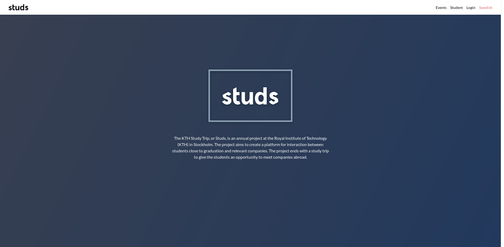

# Studs web

> The frontend for Studs (https://studieresan.se/) :hearts:

This repository contains the source code for the main Studs website
(https://studieresan.se/).



## Development setup

Install Node.js either using your favorite package manager or by installing
directly from https://nodejs.org/en/. You will also need to install yarn
for installing the required packages. Do this before continuing with the
below steps.

When you have everything setup, clone the repository with:

```
git clone git@github.com:studieresan/studs-web.git
```

Create the environments file in the project root with:

```
cp .env.example .env
```

Install the required packages with:

```
yarn install
```

Start a local development server with:

```
yarn start
```

## Developing

The development server has hot-reloading on by default, and you therefore don't
need to restart the server upon file changes.

## Deployment

The source code is deployed automatically on Netlify upon merging to master. The build command looks like `yarn build && echo '/* /index.html 200' > build/_redirects` and the publish directory is `build`. Remember to at least set the `NODE_PATH` env. variable when deploying, otherwise it will not compile.

## Contributing

1. Checkout a branch from origin/master.
2. Do your changes.
3. Push your branch to GitHub and create a pull request.
4. Get your pull request reviewed by someone.
5. If all is good; go ahead and rebase and merge with master.
